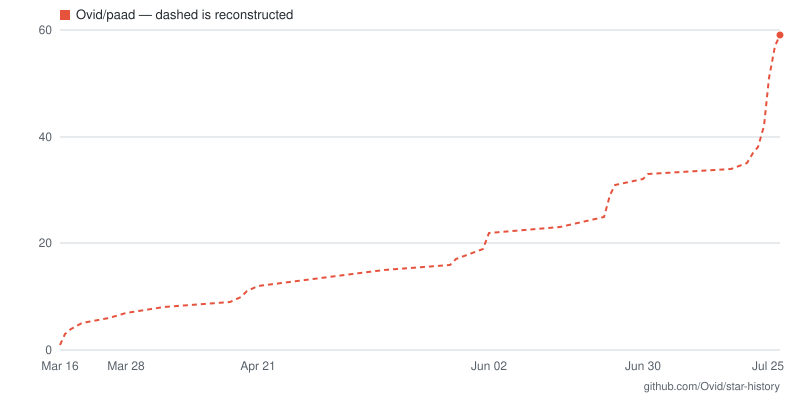
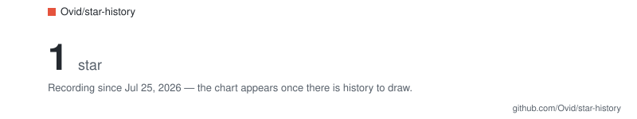
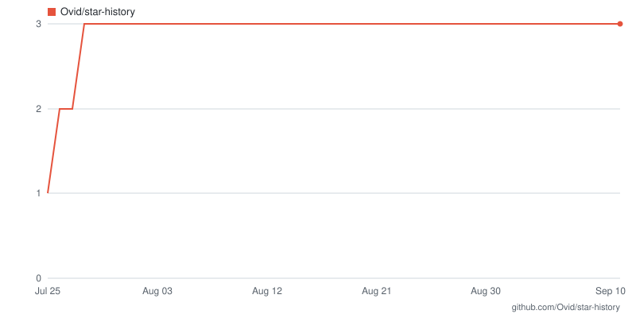

# star-history

Put a star-history chart in your README, generated inside your own repository,
with no hosted service and no AI in the loop.

Copy two files, commit, paste one snippet. A daily GitHub Action records your
star count and redraws two SVGs — one for light mode, one for dark.

If you find this useful, please star this repository. It helps me know that
the tool is worth maintaining, and it shows that the workflow is behaving
correctly..

## What you get

<picture>
  <source media="(prefers-color-scheme: dark)"  srcset="docs/example-dark.svg">
  <source media="(prefers-color-scheme: light)" srcset="docs/example-light.svg">
  
</picture>

That's a real chart of a real repository — [`Ovid/paad`](https://github.com/Ovid/paad),
freshly backfilled, which is the state your repo will be in the day you install
this. The line is dashed because every point in it was reconstructed rather than
measured; the solid line grows in from the right as the daily runs accumulate.
See [what the chart means](#what-the-chart-means-and-what-it-doesnt).

## Install

1. Copy `star_history.py` and `.github/workflows/star-history.yml` into your
   repository, keeping the workflow's path.
2. Commit and push both files. The workflow's `push` trigger fires on the
   workflow file itself, so the first chart is rendered within a minute — no
   waiting for tomorrow's cron.
3. Run `python3 star_history.py snippet` and paste the output into your README.

Two files, and only those two:

```
star_history.py                        ← copy this
.github/workflows/star-history.yml     ← and this, at exactly this path
.github/star-history/                  ← don't copy: the tool creates it
    history.json                          your record of measurements
    light.svg  dark.svg                   redrawn on every run
```

Don't copy this repository's `.github/star-history/` directory. Its
`history.json` names *this* repo and carries *this* repo's points, and a slug
mismatch is treated as a rename — the count is relabelled and the existing
points are kept, by design, so a renamed repo doesn't lose its history. Copy the
directory and your chart silently starts out containing ours.

Nothing to install, no dependencies, no build step. One file of Python 3.12
standard library.

The snippet refuses to print until the first run has produced data, so you can't
paste a block pointing at files that don't exist yet.

On day one there's a single measurement, which is not a time series — so you get
a card with the count and the date recording started, rather than a lone dot in
an empty grid:

<picture>
  <source media="(prefers-color-scheme: dark)"  srcset="docs/example-card-dark.svg">
  <source media="(prefers-color-scheme: light)" srcset="docs/example-card-light.svg">
  
</picture>

That's this repository's genuine first day, frozen so it keeps illustrating the
point. The chart takes over on the second *day* — two runs on one UTC date
dedupe to a single point, so a manual run plus the nightly cron still leaves you
with a card until tomorrow.

## Optional: backfill your existing history

A fresh install starts recording today. If you want the years before it:

```bash
gh auth login          # or export GITHUB_TOKEN
python3 star_history.py backfill
```

This is a one-time local operation. It needs admin or collaborator access to the
repository, so it works on repos you own and fails with a clear message on repos
you don't. Snapshot-only mode works everywhere and needs none of this.

## What the chart means, and what it doesn't

Two kinds of data go into it, drawn differently on purpose.

**Snapshots** (solid line) are measurements: the public star count read at a
real moment and never rewritten afterward. They can show decreases.

**Backfill** (dashed line) is a reconstruction. GitHub returns the accounts that
are starred *today*, grouped by the date each one starred — so everyone who
unstarred has been erased from the past. The reconstructed curve can only go up,
sits below what the count actually was at the time, gets less accurate the
further back it goes, and **changes if you re-run it next year**.

Backfill buys coverage, not accuracy. That's why the seam is drawn in the chart
itself rather than only described here.

Two more honest limits: the line between any two points is interpolation, so a
missed run is drawn as a smooth ramp; and `stargazers_count` is not ground truth
— spam-account purges show up as drops that nobody unstarred for.

## What this costs you

Stated plainly, because you're committing to it:

- **`contents: write` permission.** A chart in a README has to be a committed
  file, and the workflow has to commit it.
- **One bot commit per day**, in your default branch's history. The workflow
  writes a point every day whether or not the count changed, because GitHub
  disables scheduled workflows in public repos after 60 days of inactivity, and
  because a chart whose right edge freezes on the last change date looks broken.
- **Branch protection will reject the push.** `github-actions[bot]` cannot be a
  ruleset bypass actor — GitHub's eligible-actor list covers admins, org owners,
  the write and maintain roles, teams, GitHub Apps, and Dependabot, and Actions
  is not on it. So required pull requests, required status checks, or required
  signed commits will each break the daily push. Required signatures are the
  common case on personal repos. The job fails loudly rather than silently
  skipping.

### Why not put the files on a separate branch?

Because that's the obvious fix for all three costs, it deserves a straight
answer: an orphan branch — a branch with no shared history, like `gh-pages` —
would hold the generated files, leaving your default branch untouched forever.
No daily commit in `git log`, and branch protection would stop mattering
entirely, since the bot never pushes to the protected branch.

It isn't built. The reasoning is written up in
[docs/orphan-branch-mode.md](docs/orphan-branch-mode.md); the short version is
that it's a second implementation rather than a flag. The workflow would have to
check out one branch and commit to another, and `update` would have to read its
own prior state from a branch it isn't on — a real code path in the Python, not
just a YAML change.

What committing to your default branch buys, and what an orphan branch would
give up:

| | Today (default branch) | Orphan branch |
|---|---|---|
| Daily bot commit | Yes, in `git log` | None |
| Branch protection | Rejects the push | Doesn't apply |
| README paths | Relative — survive renames and transfers | Absolute `raw.githubusercontent.com` URLs, baking in `OWNER/REPO` |
| Before the first run | Works; files land in your own commit | Broken image until the workflow pushes once |
| Private repositories | Work | Don't work at all — `raw` URLs need a token |

The deciding factor is that last pair. A stranger who pastes the snippet and
sees a broken image concludes the tool is broken, and private repos would lose
the feature outright.

If you have a protected default branch or you don't want the daily commit, say
so in an issue — that's the trigger to build it, and it's written down as such.

## Operating it

**Will you be billed?** On a public repository, no — GitHub Actions is free on
standard runners, and `ubuntu-latest` is one. On a private repository the job is
a checkout, one API call, and a commit: budget a minute per run, so about 30
minutes a month against the 2,000 included on Free or 3,000 on Pro and Team.
Nothing is uploaded as an artifact, so there's no Actions storage bill — the
line item that usually does the surprising.

**What it won't do:** pushes made with `GITHUB_TOKEN` don't start new workflow
runs, so the daily commit can't trigger your CI, your deploy, or itself. The
commits are authored by `github-actions[bot]`, so they don't land on your
contribution graph. What it *will* do is bump your repository's update time
every day, so it always sorts as recently-updated, and add roughly 7–8 KB of
changed text per day — low single-digit megabytes a year after compression.

**How it fails.** Four of the five ways are loud:

| | Noise | Recovery |
|---|---|---|
| A scheduled run is delayed or dropped | **Silent** | Automatic next day |
| Branch protection rejects the push | Failed job | Needs a decision — see above |
| A human push lands mid-job | Failed job | Automatic next day |
| Actions disabled or restricted org-wide | Failed job | Needs an admin |
| GitHub restricts `stargazers_count` | Failed job | None — see below |

The silent one is worth understanding. GitHub treats `schedule` as best-effort
and may delay or skip runs under load, and a missing day is drawn as a straight
line between the points either side of it — indistinguishable from measured
data. The `17 3 * * *` schedule avoids the top-of-hour rush, which helps and
guarantees nothing.

**The 60-day rule takes care of itself, until it doesn't.** GitHub disables
scheduled workflows in public repositories after 60 days without repository
activity, and only new commits count as activity — not tags, issues, or merged
pull requests. Since this workflow commits daily, it keeps itself enabled as a
side effect. But that only holds while it's running: if it stops for any of the
reasons above, the clock starts, and it won't restart itself. Re-enable it in
the Actions tab.

## This repository's own chart

Not an illustration — the live files, rewritten by the same workflow you'd
install, committed daily:

<a href="https://github.com/Ovid/star-history">
  <picture>
    <source media="(prefers-color-scheme: dark)"  srcset=".github/star-history/dark.svg">
    <source media="(prefers-color-scheme: light)" srcset=".github/star-history/light.svg">
    
  </picture>
</a>

The alt text here deliberately carries no number, because this block is written
by hand and the image behind it changes every day. The one `snippet` prints for
you *does* include the count and date — it's regenerated whenever you re-run it,
so it can afford to be specific.

## Why this exists now

On 2026-06-30 GitHub restricted stargazer *timestamps* to a repository's admins
and collaborators. Hosted chart services read those timestamps for repos they
don't own, so that path is closed to them. The maintainer of a repo is now the
only person who can read its star history — which is why this tool runs in your
repo instead of someone else's.

Verified against the live API on 2026-07-25, using `psf/requests`:

| Call | Result |
|------|--------|
| `GET /repos/psf/requests` → `stargazers_count` | `54172` — still public |
| GraphQL `stargazers { edges { starredAt } }` | `[]` — empty, for a repo reporting 54,172 stars |
| `GET /repos/psf/requests/stargazers` with `Accept: vnd.github.star+json` | `404` |

Note the second row: the restricted response is an **empty list, not an error**.
A tool that trusts it renders a history of zero stars and calls it a success.
This one cross-checks the number of timestamps it received against
`stargazerCount` and refuses to write anything if they disagree.

The count itself is still public, so the daily snapshot works on any repository,
forever.

## License

MIT — see [LICENSE](LICENSE). Copy the two files into your own repo and go.
